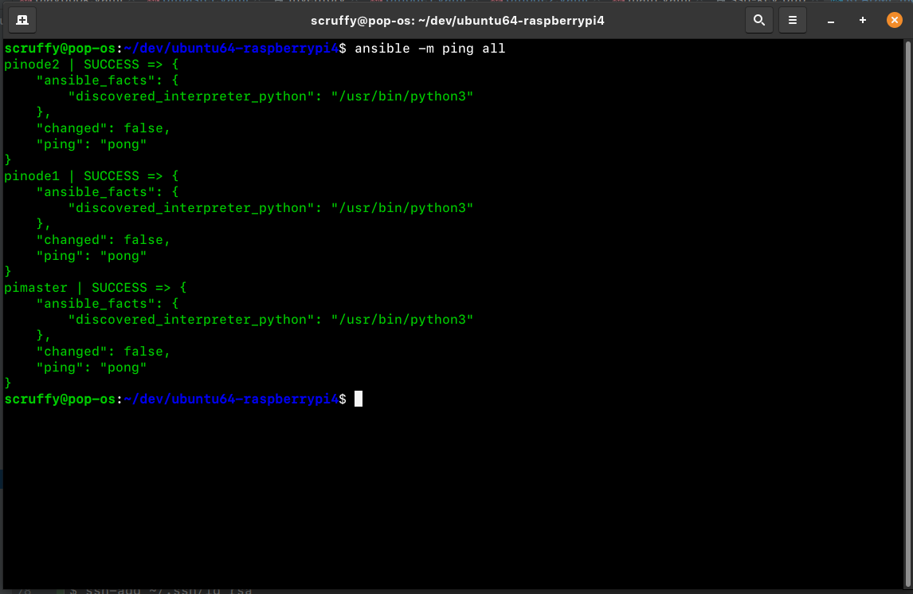

#   ubuntu64-raspberrypi4
Ansible playbook to set up a Raspberry Pi 4 Cluster.


## Actions

- Sets UTC timezone

- Sets boot cmdline file with correct cgroup options

- Creates new user: kube

- Enables password-less sudo 

- Adds public ssh key

- Configures ssh server for key-based authentication only


## Requirements

- (obviously) One or more Raspberry Pi 4s

- Install ansible and sshpass.
  In ubuntu/debian:
  
  ```bash
  $ sudo apt update && sudo apt install -y ansible sshpass
  ```


## Steps

1. Set each raspberry pi's IP, hostname and the location of the ssh key in folder `host_vars`. Replace file `roles/common/files/ssh-key.pub` with your own public ssh key.


2. Flash a microsd card with the latest ubuntu image for raspberry pi 4 (arm64) using [Balena-Etcher](https://www.balena.io/etcher/). 

    

3. Boot your raspberry pi with the microsd card and log in as username/password `ubuntu`/`ubuntu`.  You will be prompted to change the default password.


4. Update apt and install ssh package, so that ansible can connect to the raspberry pi.
   
   ```bash
   $ sudo apt update && sudo apt install -y ssh 
   ```

5. Run playbook as ubuntu user and add `--ask-pass` to make use of the user's password
   
   ```bash
   $ ansible-playbook playbook.yaml --ask-pass -u ubuntu
   ```

Once all these steps have been executed, you can run any ansible command or playbook using your ssh key





## Extra

To generate an ssh key pair:

```bash
$ ssh-keygen -t rsa -b 4096
```

To add ssh key to ssh agent:

```bash
$ ssh-add ~/.ssh/id_rsa
```